# 腾讯群课堂移动端教程

## 进入课堂

首先有两种方式进入群课堂：

在进入群聊页面后，

- 点击上方功能栏处悬浮的群课堂标签，点击进入；

- 直接点击聊天记录中的群课堂发起记录进入

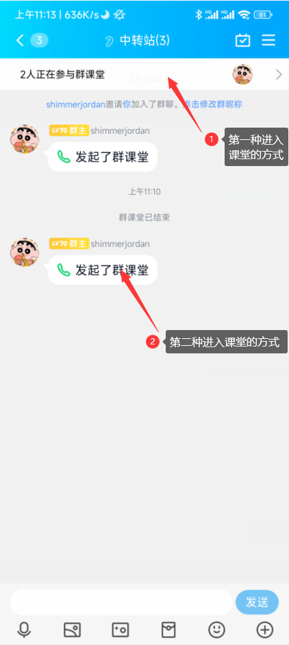

首次进入需要等待下载相关资源，耐心等待后即可进入

## 主页面功能按钮

此时已经进入了群课堂，如下图所示，左上角显示为主持人信息。下半部分为聊天交流区，最下方为主要的功能按钮。包括：

- 3：聊天发言按钮

- 4：电话连线按钮

- 右下角的其他功能按钮（多数情况不需要）

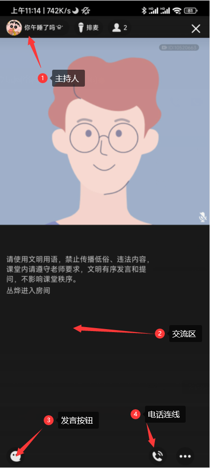 

## 连麦功能

如需连麦发言，需要进行申请并等待主持人回应。在上图的箭头`4`处进行连线的申请，点击后即进入连线排队。

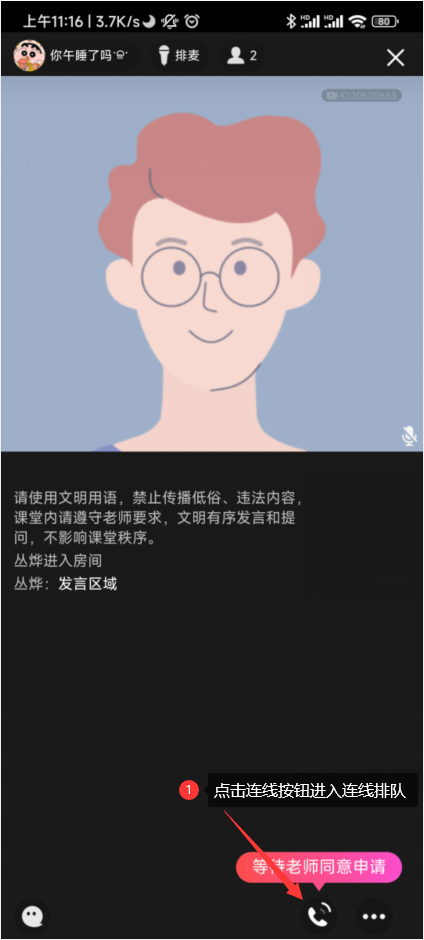 

## 可能需要的实名认证操作

因为移动版的相关规定，连麦属于直播范畴，需要进行实名认证：

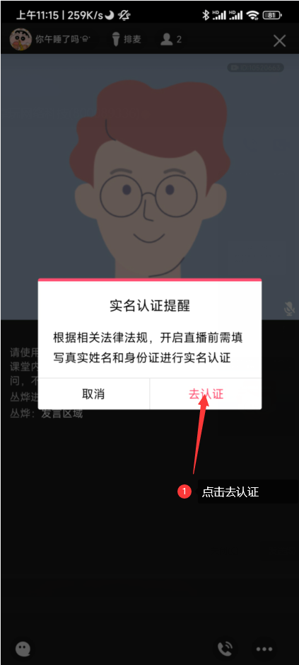 

点击`去认证`进入实名认证流程：

确认信息无误后发送验证码，如下图输入收到的短信验证码后点击提交：

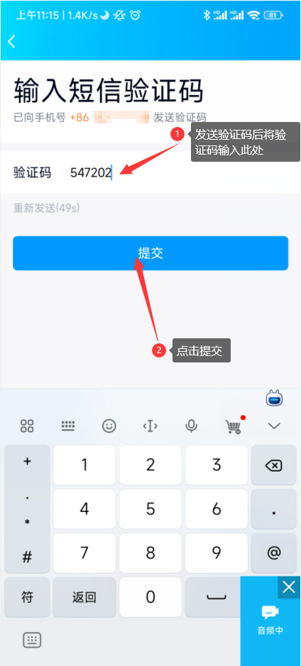 

先点击`我知道了`关闭悬浮窗，填入相关信息后勾选`我同意`并点击下一步。此后进入人脸认证环节。

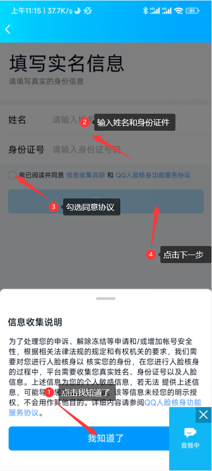 

验证完毕后提示下图的`验证成功`，即可点击返回或者直接重新进入课堂。

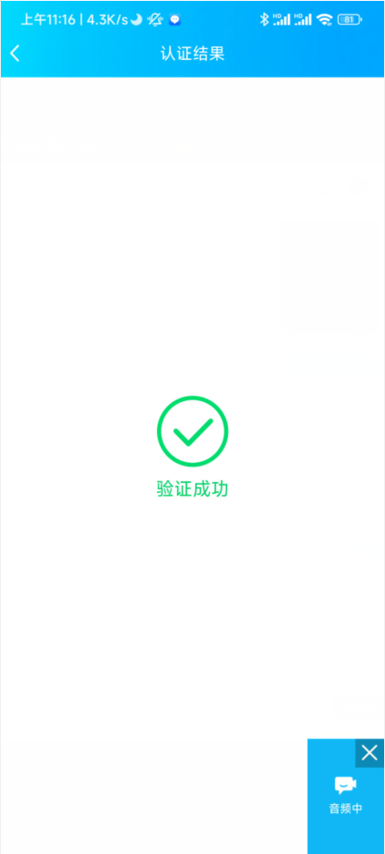 

## 连麦功能（续）

如果误点连线或者想查看排队成员，可以再次点击电话按钮，一方面可以查看队列成员，另一方面可以点击悬浮功能旗袍的的`取消连线`按钮取消连线申请。

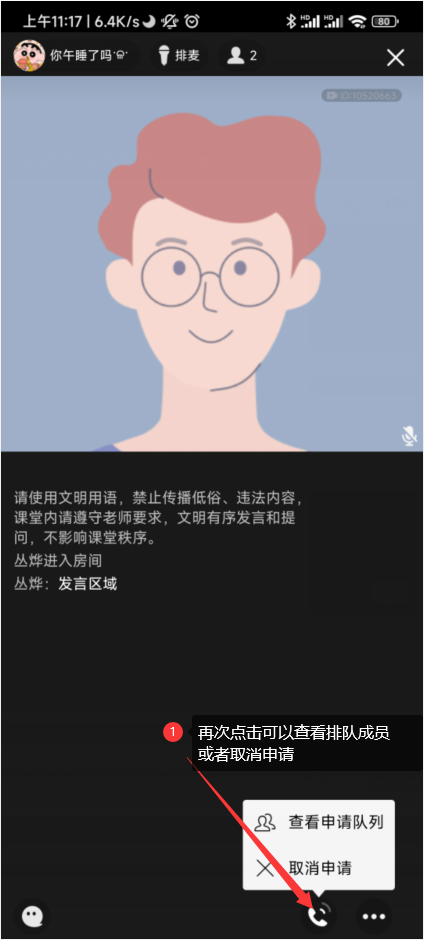

进入如下页面表示连麦成功。注意核实`3`处显示的连麦观众是否为自己。
连麦后界面中有一些功能按钮，包括：

- 4：挂断连麦按钮`结束`，点击此按钮即可结束连麦；

- 5：摄像头开关，点击即可开启摄像头（**默认关闭**）；

- 1：麦克风开关，点击即可开启/关闭麦克风（**默认关闭，连麦后需要手动开启**）；

- 其他功能按钮：暂不需要

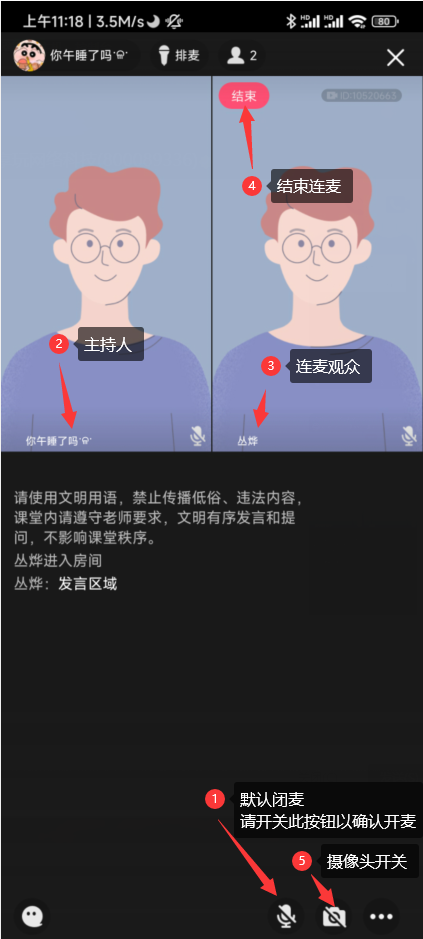

如需结束连线，点击挂断按钮后需要进行二次确认：

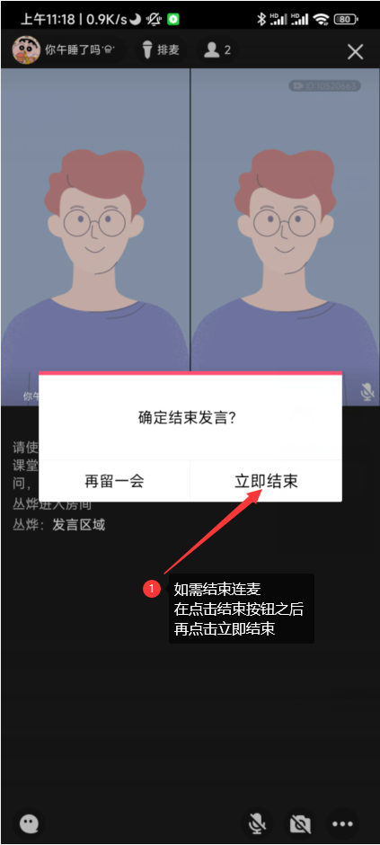

## 交流区

因为连麦只能满足一对一的需求，无法满足包并发的场景。对于不方便连麦等情况下的观众可以使用聊天交流区进行留言，等待主持人异步应答。

直接点击左下角的聊天按钮即可输入发言内容，可选加入表情但不建议。完成输入后点击发送即可发送留言。

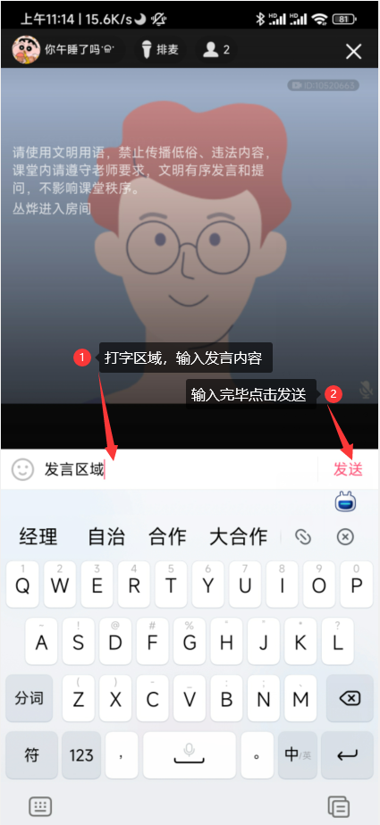

## 退出

手机端的退出可能需要进行二次确认，在点击右上角的叉叉后如果发现仍未完全提出，例如安卓手机，需要在右下角处再次点击叉叉进行退出：
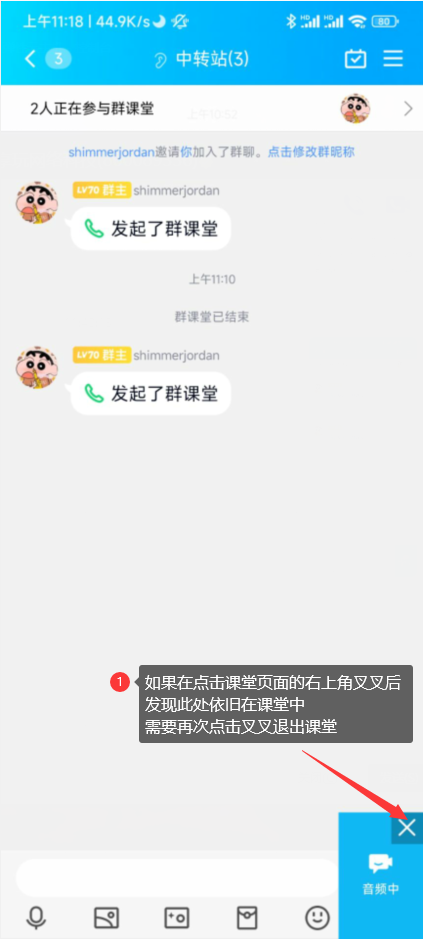
